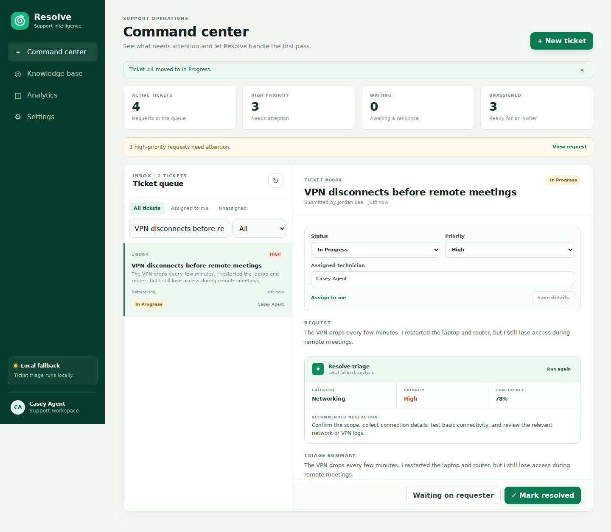
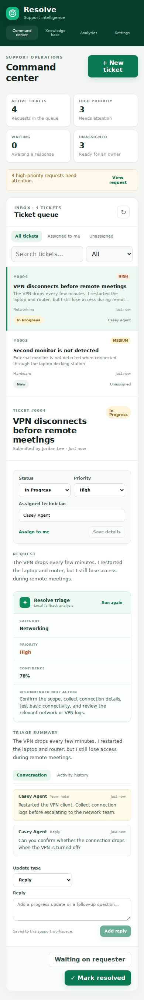

# Resolve workflow upgrade validation

Validated October 8, 2026, against the proposed upgrade branch.

- **11 automated tests passed** using disposable SQLite databases.
- **9 browser workflows passed** in headless Chromium, with no uncaught page errors.
- **Production build passed** and `git diff --check` reported no whitespace errors.
- Fresh `npm run dev` startup completed with no `.env` file, using the default local database URL.

## Automated backend coverage

The tests preserve four older tickets, their IDs, original text, priorities, custom legacy fields, and original timestamps while adding required triage fields. Repeated setup preserves edits and deleted starter articles. New tickets can be created after the old database upgrade.

API checks cover assignment, manual priority, waiting/resolution/reopening, replies and team notes, ordered history, input validation, invalid IDs, missing records, malformed JSON, shared article creation/import/rating/deletion, and persistence after reconnecting. A mocked OpenAI connection failure confirms one request attempt followed by local fallback. Live OpenAI service access was not exercised.

## Browser coverage

1. Import older browser articles and convert the legacy Open default filter to New.
2. Create a ticket and close a modal with Escape.
3. Assign a technician and save replies, notes, and history.
4. Move a ticket to Waiting, resolve it, and reopen it.
5. Filter the queue and confirm actions modify the displayed ticket.
6. Simulate a failed status request and confirm the error appears without changing the ticket.
7. Publish an article, record helpful feedback, and verify both after reload.
8. Save preferences and verify compact mode and high-priority alerts.
9. Open an independent browser process at 390px width, verify shared articles, and check dashboard, analytics, and settings for horizontal overflow.

The desktop check also verifies that the triage panel has visible content. Screenshots use fictional demonstration tickets. External font loading was disabled during these checks; browser fallback fonts were used.

## Desktop

## Mobile

